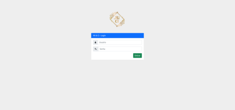

# MiCi-Admin
## WEB app for small beauty shop admin

Powered by SpringBoot, Thymeleaf, Bootstrap and SQLite.

To run the app: \
`$ ./gradlew bootRun`

---
**Default user:** \
user: admin \
password: admin

---
- Login\

- Dashboard \

- Calendar \

- Orders \

- Listing orders \

